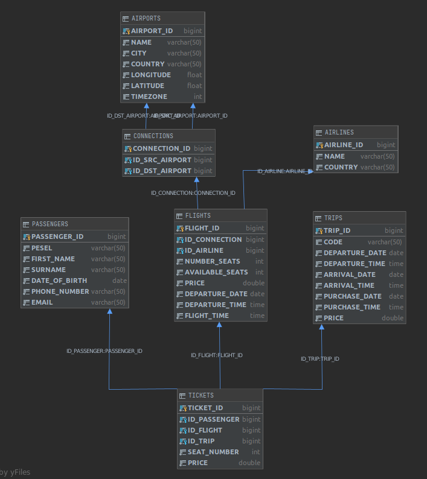

# backend

## Uruchomienie projektu
### Konfiguracja bazy danych
Zmodyfikuj ```spring.datasource.url=YOUR_PATH_TO_DB``` w application.properites z poprawnym adresem url do twojego pliku db. 

### Podgląd bazy danych w przeglądarce
Po uruchomieniu projektu wprowadź następujący adres URL
```http://localhost:8080/console```

### Podgląd bazy danych w IntelliJ IDEA Ultimate
Po uruchomieniu projektu wybierz zakładkę Database, dodaj nową bazę danych i ustaw 
poprawny adres url do twojego pliku db. 

```http://localhost:8080/console```

## Technologie
* Java 11
* Spring Boot 2.2.6
* Baza danych h2
* Flyway 
* Lombok 
* Swagger


## Opis projektu
### Wstęp
Podczas pierwszego uruchomienia projektu do bazy danych zostaje domyślnie zapisane:
* 15 lini lotniczych
* 20 lotnisk
* 200 połączeń między tymi lotniskami 
* 37698 lotów w ramach tych połączeń, z datą wylotu od 2020-09-01 do 2021-03-02 (pół roku).

Głównym założeniem projektu jest wyszukiwanie lotów pośrednich i bezpośrednich pomiędzy lotniskami na podstawie następujących parametrów:
* miejsca wylotu
* miejsca przylotu
* daty wylotu
* daty przylotu
* ilości pasażerów
* zmiennej logicznej za pomocą której wyszukiwane są loty w jedną lub dwie strony

Po uzupełnieniu tych danych na początku sprawdzane są połączenia między lotniskami. Wykorzystywane są tutaj grafy,
 a dokładnie algorytm przeszukiwania w głąb (DFS). Graficzna wizualizacja domyślnych połączeń w bazie danych:
 

Gdy połączenie zostaną znalezione, to na ich podstawie wyszukują się loty. 
Sprawdzane jest czy czas wylotu jest odpowiedni, a przypadku lotów pośrednich czy casz oczekiwania między przylotem
jednego samolotu, a odlotem kolejnego mieści się w konkretnym przedziale czasowym.
 
Każdy lot jest przypisany odpowiedniemu biletowi oraz pasażerowi. Zbiór biletów tworzy całą podróż. 

Użytkownik wybiera bilet, następnie uzupełnia formularz z danymi osobowymi. Po poprawnym zarezerwowaniu biletu,
zwracany jest jego unikalny kod. Użytkownik za pomocą specjalnej wyszukiwarki może
 wyświetlić informacje o bilecie podając jego kod.    

### Loty pośrednie
Algorytm potrafi wyszukiwać loty pośrednie. W takim przypadku można modyfikować dwa parametry:
1. maksymalna ilość przesiadek 
2. maksymalny czas oczekiwania pomiędzy przesiadkami 

Domyślnie pierwszy parametr jest ustawiony na 2 przesiadki, natomiast drugi na 12 godzin.
### Migracje bazy danych
W projekcie dodane zostały migracje bazy danych za pomocą flyway czyli systemu kontroli wersji dla baz danych. 
Domyślnie stworzone są 4 migracje w katalogu db.migration. Baza danych jest tworzona na podstawie migracji,
a jej poprawność sprawdzana na podstawie encji.

### DTO 
W przypadku komunikacji backendu z frontedem wykorzystujemy DTO (Data Transfer Object), są to obiekty specjalnie 
zmodyfikowane, zawierające tylko te elementy, który są konieczne do wykorzystania we frontendzie.
## Schematy
### DTO


### Entites


### Baza danych

